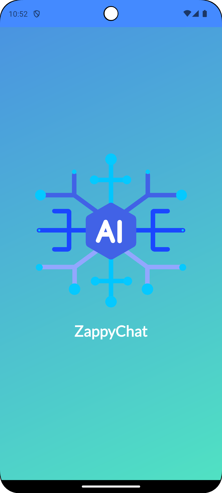
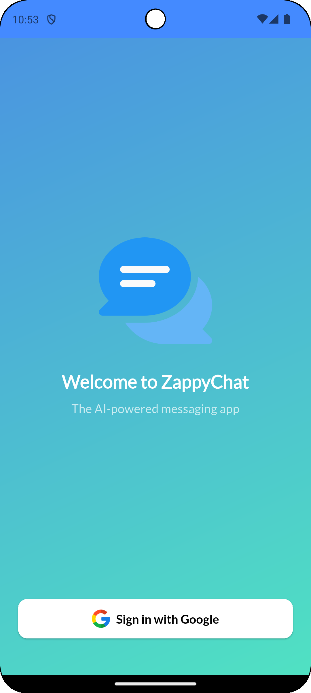
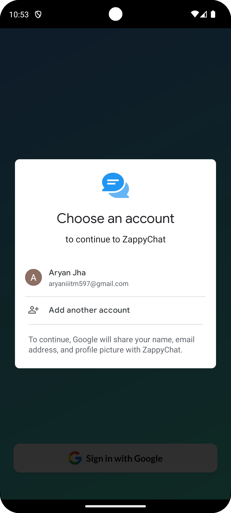
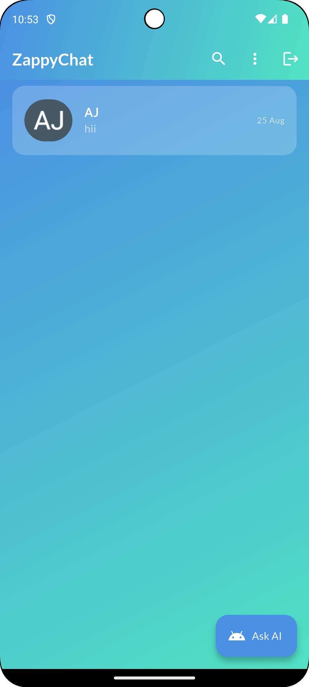
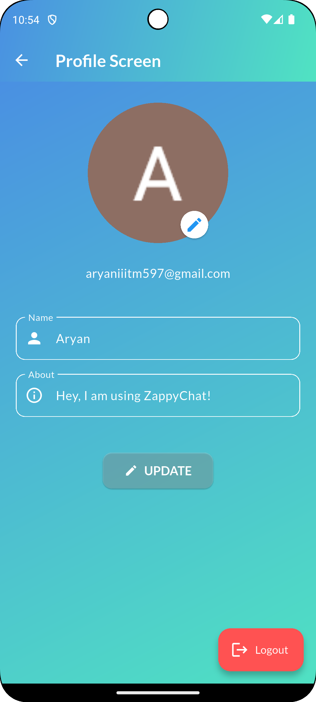
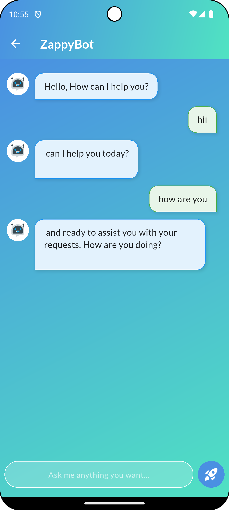
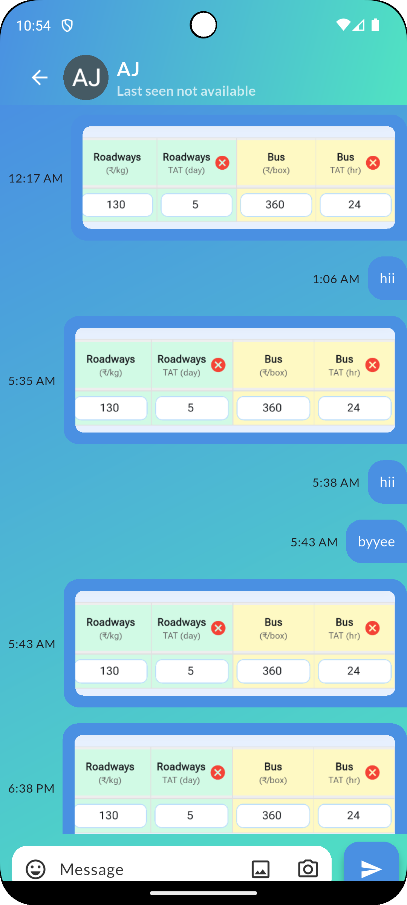
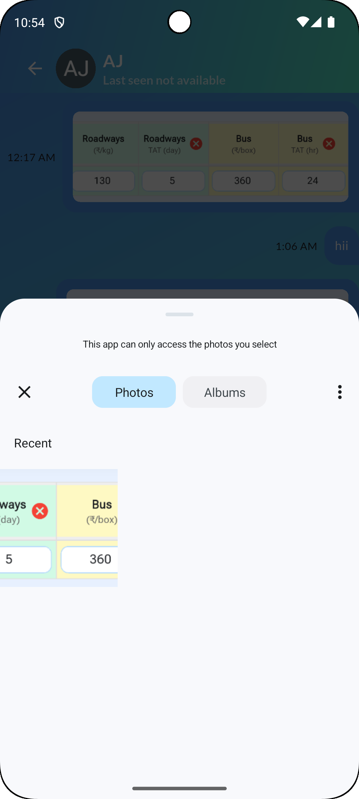

# 🚀 ZappyChat

**A modern, feature-rich & cross-platform chat application built with Flutter + Supabase.**  
Seamlessly chat with friends, manage profiles, and interact with an **AI-powered assistant (Gemini)** — all in one sleek app.  

---

## 📖 Project Overview

ZappyChat provides a **simple, decent, and modern messaging experience**.  
Users can sign in with Google, find other users by email, and engage in real-time conversations.  

✨ A key highlight is the **Gemini AI chatbot**, offering smart replies and an AI assistant for contextual help.

---

## 🛠 Core Technologies

- **Framework:** [Flutter](https://flutter.dev/) (cross-platform, single codebase)  
- **Language:** Dart  
- **Backend:** [Supabase](https://supabase.com/)  
  - 📂 Database → User profiles & chat messages  
  - 🔑 Authentication → Google Sign-In  
  - 🔔 Real-time subscriptions → Live chats & online presence  
  - 🖼 Storage → Image uploads (camera/gallery)  
- **State Management:** [Riverpod](https://riverpod.dev/)  
- **AI Integration:** [Google Gemini API](https://aistudio.google.com/)  

---

## 📸 Screenshots

**Actual app looks even better in action!** 😍  

  
  
  
  
  
  
  
  

---

## ✨ Features

- 🔥 **Real-time messaging** with Supabase subscriptions  
- 🔑 **Google Sign-In** (no need for phone numbers)  
- 👤 **User profiles** with name, email, photo, status, last seen  
- 🟢 **Online presence tracking** & last active time  
- 💬 **Smart replies** powered by Gemini AI  
- 🤖 **Dedicated AI assistant chat screen**  
- 🖼 **Multimedia messaging** (text, images, emojis)  
- 🗑 **Message delete & edit options**  
- 🔔 **Push notifications**  
- 🎨 **Sleek Material UI** with Lottie animations  
- 🔍 **Search users by email**  
- 📱 **Cross-platform (Android/iOS)**  

---

## 🔄 Application Flow

- **Splash Screen** → App initializes Supabase & checks auth  
- **Login Screen** → Google Sign-In  
- **Home Screen** → User list, search, profile access, logout, “Ask AI” button  
- **Chat Screen** → One-to-one conversations with images, emojis, smart replies  
- **AI Screen** → Full conversation with Gemini chatbot  
- **Profile Screens** → View & edit your own profile, view others’ profiles  

---

## 📂 Project Structure

- lib/
-  ┣ api/           # Supabase API integration
-  ┣ models/        # Data models (ChatUser, Message, etc.)
-  ┣ providers/     # Riverpod state management
-  ┣ screens/       # UI screens (auth, main, profile, widgets)
-  ┣ helper/        # Utility classes (date formatting, theme)
- assets/           # Static assets like images and Lottie animations

---

## 📦 APK Download

- **Latest Release APK:**  
  [Download APK](https://drive.google.com/file/d/1WbCGODOEX9FYstzoBMumpdLQyU-wZKY-/view?usp=sharing) (~62.4 MB)

---

## 💬 Feedback & Contact

- We’d love to hear your feedback or suggestions! Reach out via email:
- 📧 aryanjha230705@gmail.com
